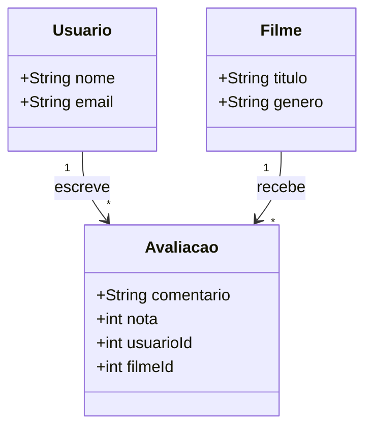

# 🎬 CineLog

 Sistema de cadastro e avaliação de filmes desenvolvido com:

* Frontend: HTML, CSS, JavaScript + Bootstrap
* Backend: Node.js + Express + SQLite
* Arquitetura: API REST

---

## 🚀 Funcionalidades

* Cadastrar usuários, filmes e séries
* Listar usuários, filmes e séries
* Editar registros
* Deletar registros
* Avaliar filmes e deixar comentários

---

## 🧠 Domínio do Sistema

* **Filme**
* **Usuário**
* **Avaliação**

---

## 🔗 Relacionamentos

* Um Filme pode ter várias Avaliações
* Um Usuário pode fazer várias Avaliações
* Avaliação pertence a um Filme e a um Usuário

👉 Filme pode existir sem Avaliação
👉 Avaliação não existe sem Filme nem Usuário

---

## 📊 Diagrama de Classes (UML)



---

## ⚙️ Como executar o projeto

### 🖥️ Backend (Node.js)

Entrar na pasta do backend:

```bash id="b1"
cd Backend
```

Instalar dependências:

```bash id="b2"
npm install
```

Rodar o servidor:

```bash id="b3"
node src/server.js
```

ou:

```bash id="b4"
npm start
```

Servidor roda em:

```text id="b5"
http://localhost:3000
```

---

### 🌐 Frontend (HTML/JS)

Abrir o arquivo:

```text id="f1"
Frontend/index.html
```

Ou usar extensão **Live Server** no VS Code.

---

## 🚀 Deploy

### Backend (API)

* Hospedado no Render
* URL: https://cinelog-xh2s.onrender.com

### Frontend

* Hospedado no Vercel
* URL: https://cine-log-chi.vercel.app

---

## 🔗 Comunicação Front + Back

No frontend, a API deve apontar para:

```javascript id="api1"
const API = "https://cinelog-xh2s.onrender.com";
```

❌ Não usar:

```text id="api2"
localhost
```

---

## 📦 Tecnologias utilizadas

* Node.js
* Express
* SQLite
* HTML
* CSS
* JavaScript
* Bootstrap
* Render
* Vercel

---

## 👩‍💻 Autora

Maria Dalva de Oliveira Gomes
Graduanda em Ciência da Computação – UEPB

---

## ⭐ Observação

Este projeto foi desenvolvido com foco em:

* Prática de API REST
* Integração frontend e backend
* Deploy de aplicações reais
* Organização de arquitetura web moderna
