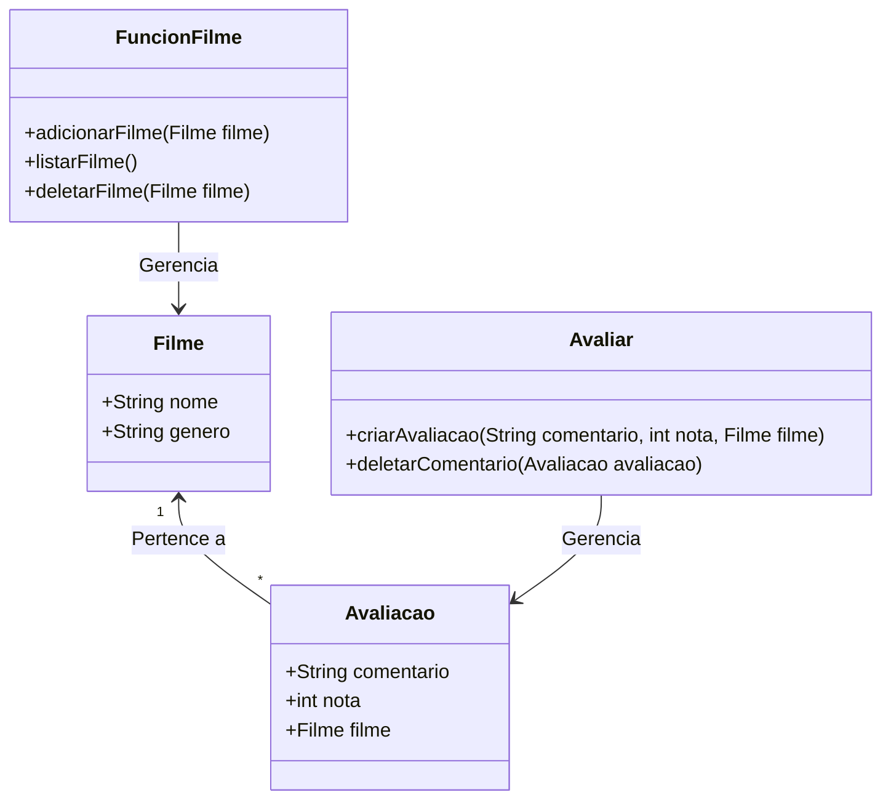

## Funcionalidades
- Cadastrar filmes e séries 
- listar filmes/séries
- Editar
- Avaliar e comentar
- Deletar 
  ## Class do  dominío
 - Filme 
- Avaliação
## Relacionamento
   *Filme existe sem Avaliaçao, mas avaliação não existe sem filme. / Composição*



```
- Filme e Avaliacao: São apenas Entidades. A única responsabilidade delas é definir quais dados pertencem a um filme e a uma avaliação.
- FuncionFilme: Tem a responsabilidade única de gerenciar(adicionar, listar e deletar). Ela não cria regras de validação de notas ou textos de comentários.
- Avaliar: Tem a responsabilidade única de armazenar e gerenciar a lógica de avaliações (criar e limpar os comentários do banco/memória).
```
